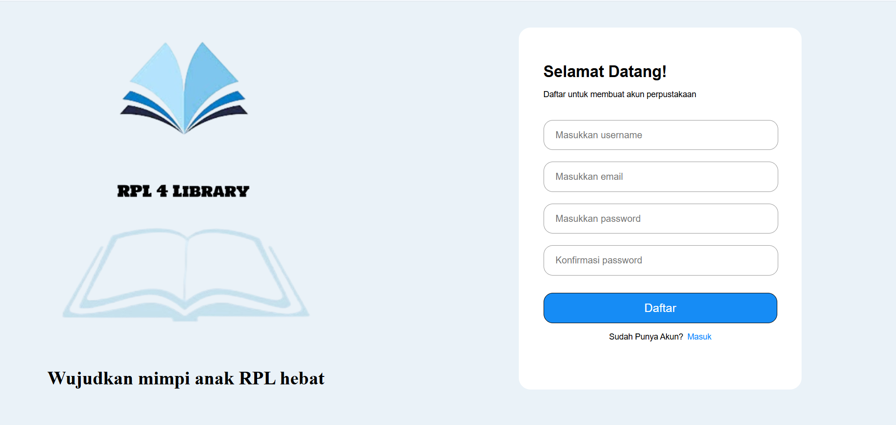

# Perpustakaan Mini

Aplikasi perpustakaan berbasis HTML, CSS, dan JavaScript untuk membantu pengguna
menjelajahi koleksi buku, melihat detail buku, menyimpan favorit, dan mengatur
waktu membaca.

## Struktur Folder

```text
project-perpustakaanMini/
├── app.js                 # Logika utama aplikasi dan pengelolaan data
├── assets/                # Sampul buku dan aset aplikasi
├── assets2/               # Screenshot tampilan aplikasi
├── buku.html              # Daftar buku dan filter kategori
├── buku.css
├── dashboard.html         # Halaman utama setelah login
├── dashboard.css
├── daftar.html            # Halaman pendaftaran akun
├── daftar.css
├── detail-buku.html       # Detail buku dan aksi pengguna
├── detail-buku.css
├── detail-buku.js
├── detailpp.html          # Detail profil pengguna
├── detailpp.css
├── login.html             # Halaman login
├── login.css
├── notif.html             # Halaman notifikasi
├── notif.css
├── profile.html           # Halaman profil
├── profile.css
├── riwayat.html           # Halaman riwayat membaca
├── riwayat.css
├── setting.html           # Halaman pengaturan
├── setting.css
├── waktu.html             # Halaman pengaturan waktu membaca
└── waktu.css
```

## Fitur

- Login dengan username atau email.
- Pendaftaran akun pengguna.
- Dashboard dengan sapaan pengguna dan navigasi utama.
- Daftar koleksi buku lengkap dengan sampul, judul, penulis, dan kategori.
- Pencarian buku berdasarkan judul, penulis, atau kategori.
- Penyaringan buku berdasarkan kategori.
- Halaman detail buku yang menampilkan rating, ulasan, penerbit, tahun terbit,
  ISBN, dan deskripsi.
- Tombol baca buku dan navigasi kembali ke dashboard.
- Menambahkan atau menghapus buku dari daftar favorit.
- Mengatur waktu membaca buku.
- Halaman notifikasi, riwayat, profil, dan pengaturan.
- Penyimpanan nama pengguna, favorit, dan jadwal membaca menggunakan
  `localStorage` sehingga data tetap tersedia selama data browser tidak dihapus.

## Cara Menjalankan

1. Buka folder proyek di Visual Studio Code.
2. Jalankan `login.html` menggunakan Live Server atau buka langsung di browser.
3. Masuk menggunakan username/email dan password apa saja untuk mencoba alur
   aplikasi.

## Preview Tampilan

### Register



### Login


### Dashboard


### Daftar Buku


### Atur Waktu Membaca


### Riwayat


### Notifikasi


### Profil


### Pengaturan


